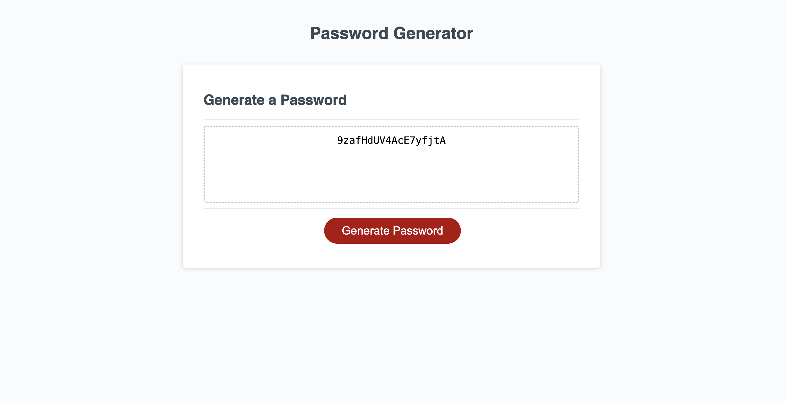

# JavaScript_Password_Generator

This module challenge us to created an apllication that a user can use to generate a random password based on the critiria they've selected. The password can include special characters, lowercase, uppercase, and numeric

